# <font color="turquoise"> <p style="text-align:center"> Remote-SSH Kaggle using Visual Studio Code </p> </font>


<div align="center">
    
</div>
<br>

<div align="center">
    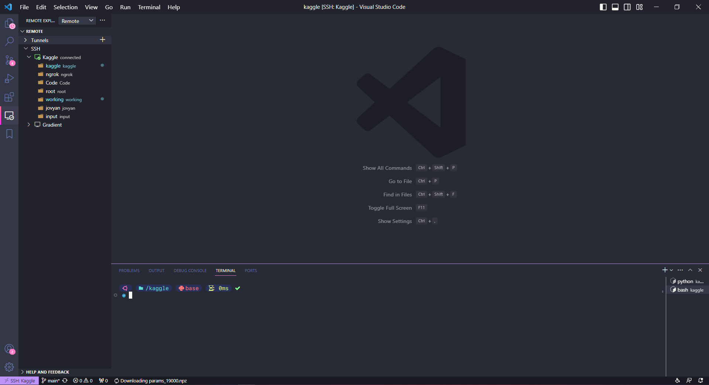
</div>

<br>

This repository provides a convenient way to remotely connect to Kaggle using Visual Studio Code, enabling you to maximize the benefits of Kaggle's utilities. With this setup, you can maintain a continuous 12-hour session without interruptions. Additionally, you can extend the GPU usage from the default 30 hours per week to 42 hours by following a simple procedure (closing the notebook session at the end of the 29th hour, SSH back in, and maintain it for an additional 12 hours :v). This setup allows for easier usage of the terminal and debugging capabilities compared to the notebook interface provided by Kaggle. Furthermore, you can utilize and manage .`py files` effortlessly. And there are many more exciting features for you to explore!
<br>

# <font color="magenta"> <p style="text-align:center"> Getting Started </p> </font>


# 1. Install Visual Studio Code and create account Ngrok

- Download and install Visual Studio Code: https://code.visualstudio.com/ 
- Create account Ngrok: https://ngrok.com/

# 2. Generate SSH-key


> **Note:** Windows & Linux similar.

- **2.1** Open Terminal / Command Prompt.

- **2.2** Paste the text below:
    ```bash
    ssh-keygen -t rsa
    ```
    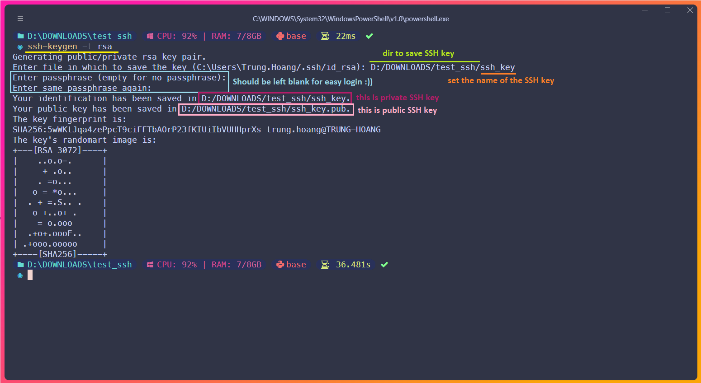


- **2.3** Push SSH public key to GitHub
    - Move to the dir where the ssh-key is saved, rename the file **ssh_key.pub** to **authorized_keys**:
    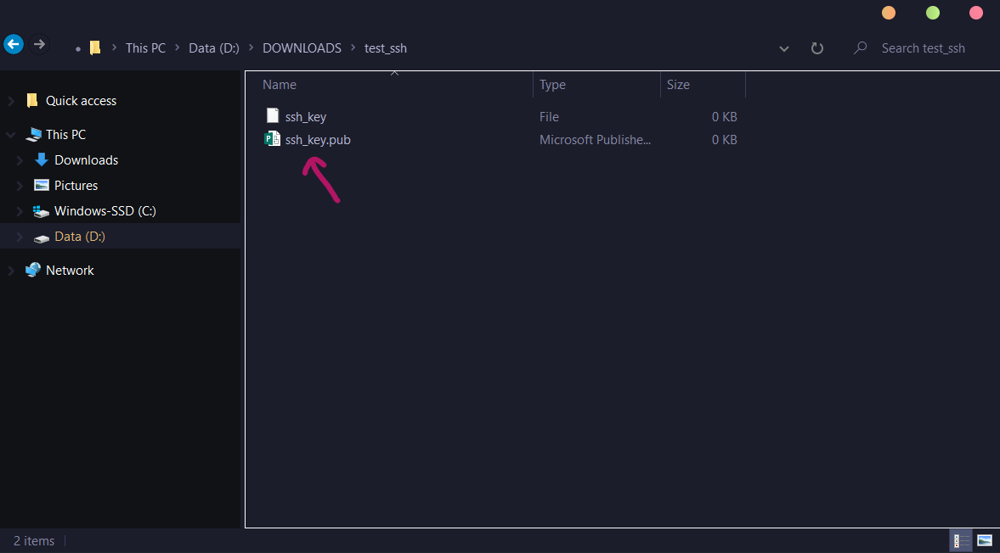
    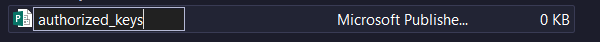
    - Push file **authorized_keys** to GitHub and make it public, for example mine: [hoangtrung020541/SSH_Key_public](https://github.com/hoangtrung020541/SSH_Key_public)

# 3. Environment settings

- **3.1** Go to Kaggle notebook: [Notebook Example](https://www.kaggle.com/hongtrung/ssh-kaggle-visualstudiocode)

- **3.2** Choose `Copy & Edit`:
    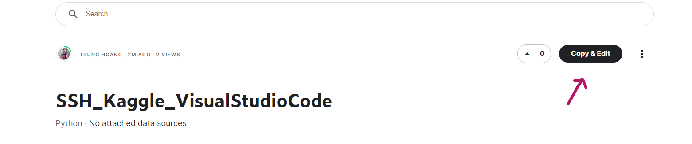

- **3.3** In the right-hand bar, choose 1 of these 2 GPUs. TPU is not supported:
    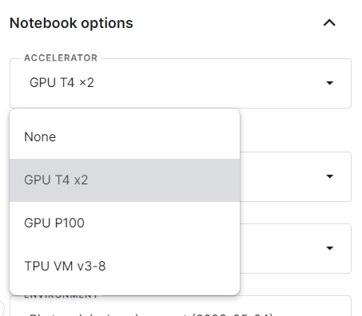

- **3.4** At `persistence`, select `Files only` to save files every time you Stop Session:
    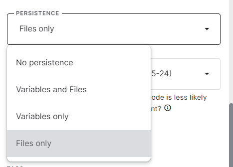


- **3.5** Go to the GitHub repo to save the SSH public key that you uploaded in step **2.3** -> Select `raw`:
    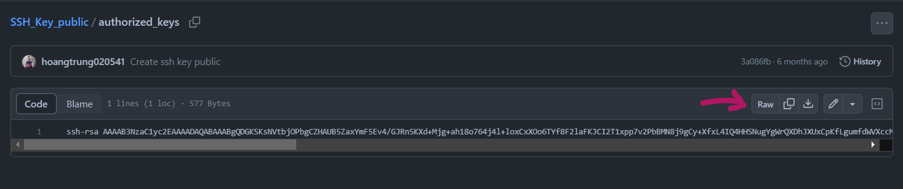

- **3.6** And coppy the above link:
    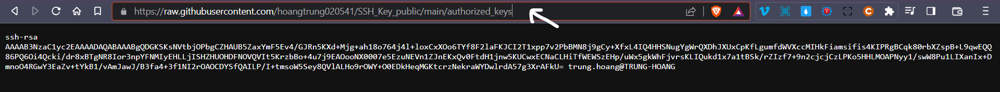

- **3.7** For `public_key_path`, paste the link copied from step **3.6**:
    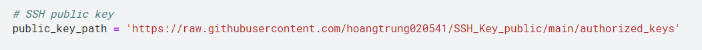


- **3.8** Go to [Ngrok](https://ngrok.com/) -> Your Authtoken -> press copy:
    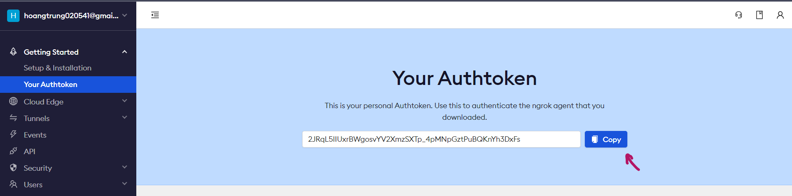

- **3.9** Run the notebook cells from top to cell as shown in the picture, paste the Ngrok token saved from step **3.8** where the arrow points:
    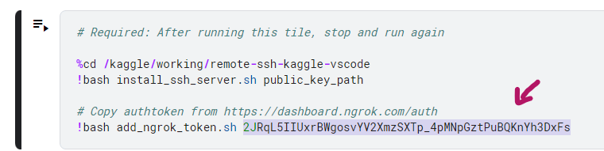

- **3.10** In this cell you have to run twice, press `stop` and run again:
    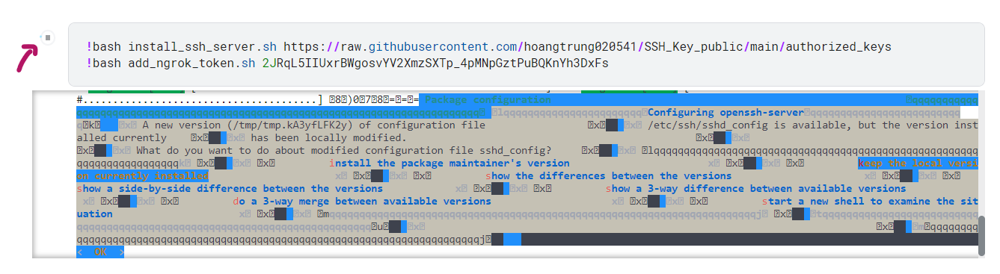

- **3.11** Then re-run again, output like the following image is ok:
    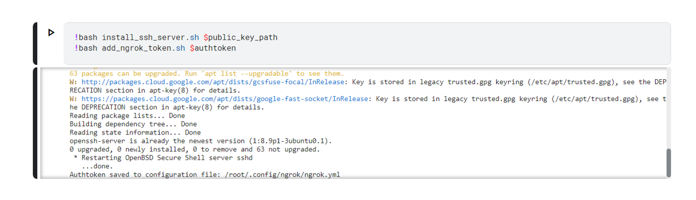

- **3.12** In the last cell, notice the red square, which is `HostName: 0.tcp.ap.ngrok.io` and `Port: 17520`. Make a note to use for step **4.6**.
    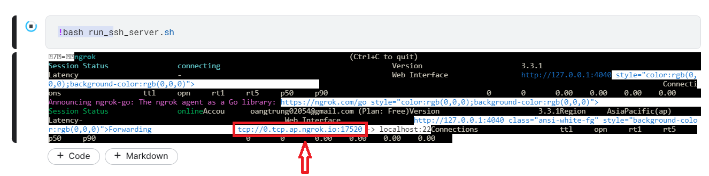

# 4. Install SSH configuration on Visual Studio Code

- **4.1** Press `Ctrl Shift X`, search SSH and install the following 2 extentions:\
    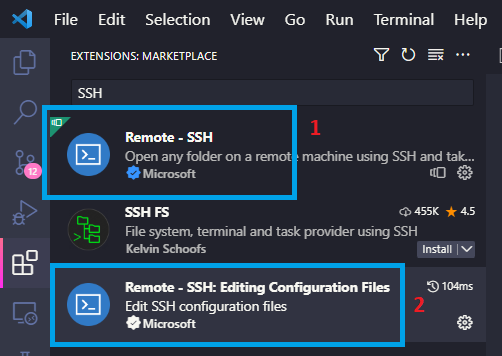

- **4.2** Note: How to SSH in detail see here (https://code.visualstudio.com/docs/remote/ssh)

- **4.3** Press `Ctrl Shift P` -> `Remote-SSH: Connect to Host…`\
    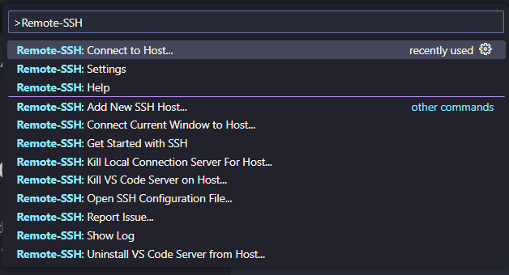

- **4.4** Press `Configure SSH Host…`\
    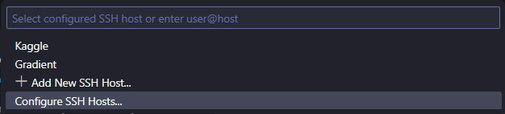

- **4.5** Select `~/.ssh/config`, usually the first file.\
    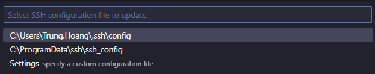

- **4.6** Add the following information to the config file:
    - Host: SSH's name, whatever you want
    - HostName: Server's IP address (in step **3.12**)
    - Port: red number (in step **3.12**)
    - User: root (keep the same)
    - IdentityFile: Path to private key (in step **2.2**)
    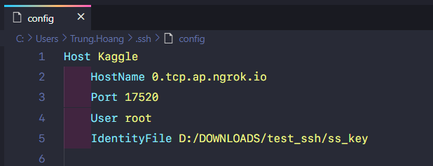s

- **4.7** Press `Ctrl S` and `Ctrl Shift P` -> `Remote-SSH: Connect to Host…`
    

- **4.8** Press `Kaggle` that you named `Host: Kaggle`
    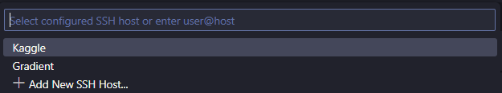

- **4.9** Press `continue` (Note: If a list appears to select the operating system, please select `linux`):
    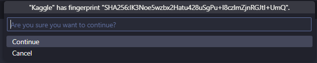

- **4.10** At the bottom left corner shows as shown in the picture that ssh was successful:
    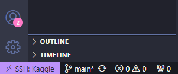

# 5. Using

- **5.1** Press `Ctrl K O` -> Enter the path `/kaggle` -> Press `ok`.
    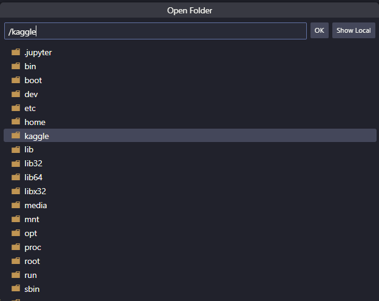

- **5.2** Open terminal press `Ctrl J` -> enter `conda init` -> press kill as shown in the picture.
    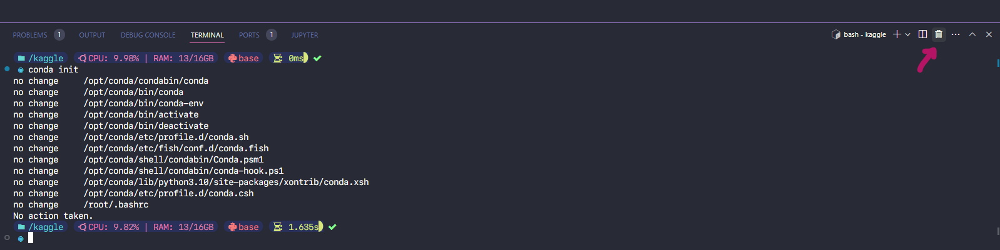


- **5.3** Activate cuda:
    <!-- - Run the following scripts in terminal to install cuda (`Ctrl J` to open terminal):
        ```bash
        cd /kaggle/working/remote-ssh-kaggle-vscode
        bash install_cuda.sh
        ```
    - Select language and press OK as shown in the picture:
    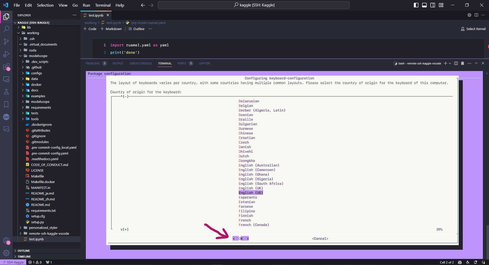 -->

    - Run the following scripts in terminal to activate cuda (`Ctrl J` to open terminal):
        ```bash
        sudo apt install nvidia-utils-515 -y
        ```


- **5.4** Check GPU `nvidia-smi`:
    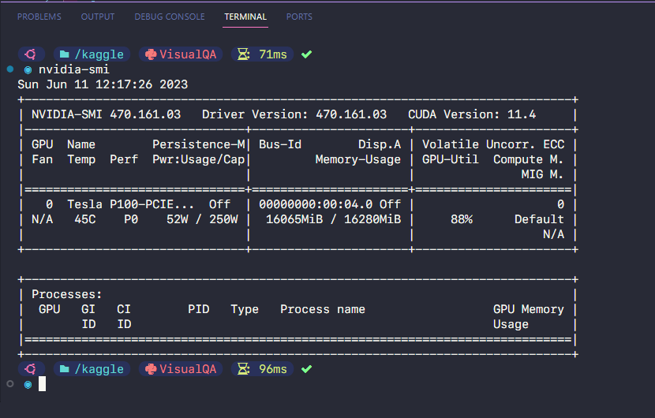


- **5.6** After each time stopping a session and running a new session notebook on Kaggle, you only need to perform the following operations in order to continue using: **3.10 -> 3.11 -> 3.12 -> 4.3 -> 4.4 -> 4.5 -> 4.6 -> 4.7 -> 4.8 -> 4.9 -> 5.1 -> 5.2 -> 5.3 -> 5.4**.


# <font color="clay"> <p style="text-align:center"> Tips and Tricks </p> </font>

Here are some tips and tricks to make the most out of your remote-SSH Kaggle setup:
- To maintain a continuous session, remember to close the notebook session and SSH back in before reaching the 30-hour GPU usage limit. By doing so, you can extend your GPU usage to a maximum of 42 hours per week.
- Use the terminal in Visual Studio Code for easier command-line interactions and workflows.
- Take advantage of the debugging capabilities in Visual Studio Code to streamline your Kaggle projects.
- Easily manage and work with .py files by organizing your code in a familiar file-based structure.
- On the right bar of the `Data` section you will see 2 sections `Input` and `Output`:
    - With `Input` as the place to receive data from kaggle and you do not have the right to edit on visual studio code, the corresponding dir is `/kaggle/input/...` The maximum storage memory for your private data is ~107GB, and for public data is unlimited.
    - `Output` is where you will work, corresponding to the dir of `/kaggle/working/...` Maximum storage memory is ~20GB.
    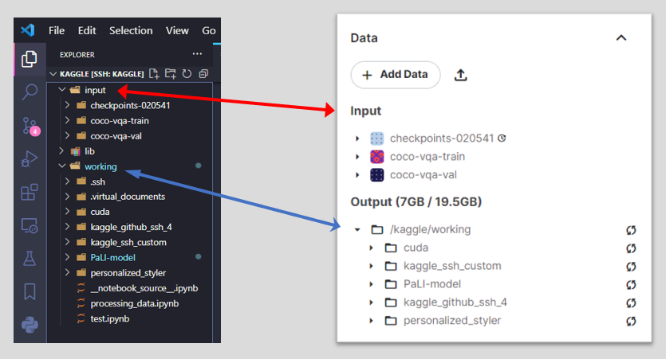


# Conclusion
With remote-SSH Kaggle using Visual Studio Code, you can unlock the full potential of Kaggle and enjoy a seamless development experience. Start leveraging the power of Kaggle's utilities while benefiting.