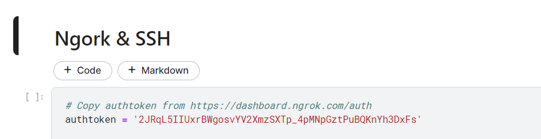

# 1. Install Visual Studio Code and create account Ngrok

- Download and install Visual Studio Code: https://code.visualstudio.com/ 
- Create account Ngrok: https://ngrok.com/

# 2. Generate SSH-key


:::{.callout-note}
Windows & Linux similar. 

:::

- 2.1 Open Terminal.


- 2.2 Paste the text below:
    ```bash
    ssh-keygen -t rsa
    ```
    

- 2.3 Push SSH public key to GitHub
    - Rename linux_ssh to authorized_keys then upload it to a public repo on github like this one: [hoangtrung020541/SSH_Key_public](https://github.com/hoangtrung020541/SSH_Key_public)

# 3. Environment settings


- Move into Kaggle notebook: [Kaggle Notebook Example](https://www.kaggle.com/hongtrung/ssh-kaggle-visualstudiocode) 

- Choose `Copy & Edit`
    

- Move into Ngrok and get tokens: [Ngrok](https://ngrok.com/) 
    

- Edit the `authtoken` to your ngrok token:\
    

- For `public_key_path`, go to the GitHub repo to save the SSH public key that you uploaded in step `2.3 `
    

- Select `raw`:
    

- And save the above link to use:
    

- In the right-hand bar, choose 1 of these 2 GPUs. TPU is not supported.\
    


- At `persistence`, select `Files only` to save files every time you Stop Session.\
    

- Run the notebook cells from top to bottom to the following cell then press the `stop` icon as shown in the picture:
    

- Then re-run again, output like the following image is ok:
    

- In the last cell, notice the red square, which is `HostName: 0.tcp.ap.ngrok.io` and `Port: 17520`. Make a note to use for step 4.
    

# 4. Install SSH configuration on Visual Studio Code

- Press `Ctrl Shift X`, search SSH and install the following 2 extentions:\
    

- Note: How to SSH in detail see here (https://code.visualstudio.com/docs/remote/ssh)

- Press `Ctrl Shift P` -> `Remote-SSH: Connect to Host…`\
    


- Press `Configure SSH Host…`\
    

- Select `~/.ssh/config`, usually the first file.\
    

- Add the following information to the config file:
    - Host: SSH's name, whatever you want
    - HostName: Server's IP address (in step 4)
    - Port: red number (in step 4)
    - User: root (keep the same)
    - IdentityFile: Path to private key (In step 2.2)\
    

- Press `Ctrl S` and `Ctrl Shift P` -> `Remote-SSH: Connect to Host…`\
    

- Press `Kaggle` that you named `Host: Kaggle`\
    

- At the bottom left corner shows as shown in the picture that ssh was successful\
    

# 5. Using

- Press `Ctrl K O` -> Enter the path `/kaggle` -> Press `ok`.\
    

- Open terminal press `Ctrl J` -> enter `conda init` and turn it off and on again

- Check GPU `nvidia-smi`:\
    

- On the right bar of the `Data` section you will see 2 sections `Input` and `Output`:
    - With `Input` as the place to receive data from kaggle and you do not have the right to edit on visual studio code, the corresponding dir is `/kaggle/input/...` The maximum storage memory for your private data is ~107GB, and for public data is unlimited.
    - `Output` is where you will work, corresponding to the dir of `/kaggle/working/...` Maximum storage memory is ~20GB\
    
