# <font color="turquoise"> <p style="text-align:center"> Remote-SSH Kaggle using Visual Studio Code </p> </font>


<div align="center">
    
</div>
<br>

<div align="center">
    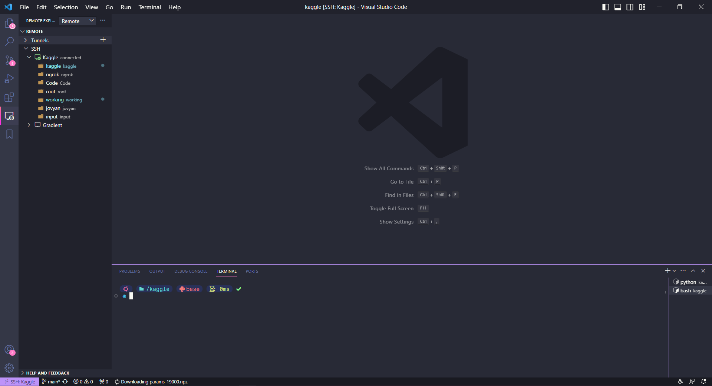
</div>

<br>

This repository provides a convenient way to remotely connect to Kaggle using Visual Studio Code with **password authentication**, enabling you to maximize the benefits of Kaggle's utilities. With this setup, you can maintain a continuous 12-hour session without interruptions. Additionally, you can extend the GPU usage from the default 30 hours per week to 42 hours by following a simple procedure (closing the notebook session at the end of the 29th hour, SSH back in, and maintain it for an additional 12 hours :v). This setup allows for easier usage of the terminal and debugging capabilities compared to the notebook interface provided by Kaggle. Furthermore, you can utilize and manage .`py files` effortlessly. 

**✨ Key Features:**
- ✅ **Password Authentication** - No need to generate SSH keys!
- ✅ **Modular Bash Scripts** - Easy to maintain and customize
- ✅ **Includes Oh My Posh** - Beautiful terminal (optional)
- ✅ **Simple Setup** - Just a few steps to get started

**📝 How It Works:**
The notebook clones this repository and uses bash scripts (`install_ssh_server.sh`, `add_zrok_token.sh`, `run_ssh_server.sh`) to set up SSH server with password authentication, then exposes port 22 through a private zrok TCP tunnel (`zrok2 share private --backend-mode tcpTunnel`).

> **zrok vs ngrok:** zrok TCP shares are private-only, so there is no public `HostName:Port`. Your laptop runs `zrok2 access private --bind 127.0.0.1:2222 <share-token>` (same zrok account on both sides), and VS Code always connects to `127.0.0.1:2222`. Each share run mints a new token — reconnects only need the new token, not a new SSH config entry.

And there are many more exciting features for you to explore!
<br>

# <font color="magenta"> <p style="text-align:center"> Getting Started </p> </font>


# 1. Install Visual Studio Code, zrok, and create a zrok account

- Download and install Visual Studio Code: https://code.visualstudio.com/ 
- Create a zrok account: https://myzrok.io/ (generous free tier) and copy your **account token** from the console
- Install `zrok2` on your **laptop** (see https://docs.zrok.io/docs/getting-started) and enable it with the **same** account:
    ```bash
    zrok2 enable YOUR_ZROK_ACCOUNT_TOKEN
    ```

# 2. Environment settings

- **2.1** Go to Kaggle notebook: [Notebook Example](https://www.kaggle.com/hongtrung/ssh-kaggle-visualstudiocode)
    - Or upload `notebook_example.ipynb` from this repository

- **2.2** Choose `Copy & Edit`:
    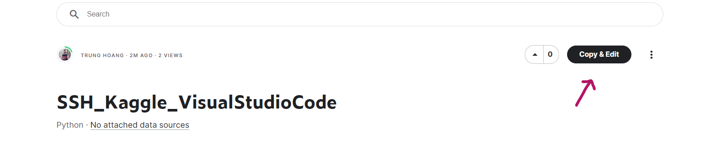

- **2.3** In the right-hand bar, choose 1 of these 2 GPUs. TPU is not supported:
    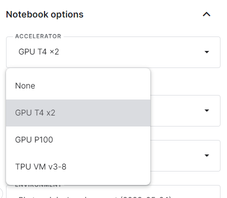

- **2.4** At `persistence`, select `Files only` to save files every time you Stop Session:
    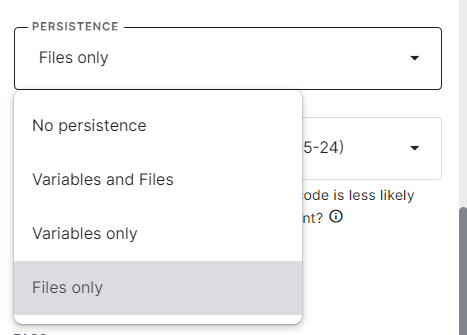


- **2.4** Go to your zrok console (https://myzrok.io/) -> copy your **account token**

- **2.5** In cell 3 (the setup cell), set your SSH password and enable zrok with your account token:
    ```python
    ssh_password = "kaggle"  # Change this to your desired password
    
    # Run bash scripts
    !bash install_ssh_server.sh $ssh_password
    !bash add_zrok_token.sh YOUR_ZROK_ACCOUNT_TOKEN  # Replace with your actual token (same account as your laptop)
    ```

- **2.6** In the last cell (cell 4 - runs `bash run_ssh_server.sh`), copy the **share token** from output like `zrok2 access private <share-token>`. Then on your **laptop**, run:
    ```bash
    zrok2 access private --bind 127.0.0.1:2222 <share-token>
    ```
    Leave that command running and use `127.0.0.1:2222` for step **3.6**.

# 3. Install SSH configuration on Visual Studio Code

- **3.1** Press `Ctrl Shift X`, search SSH and install the following 2 extentions:\
    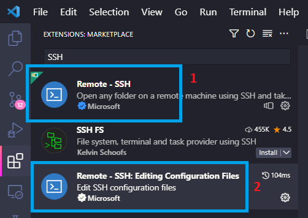

- **3.2** Note: How to SSH in detail see here (https://code.visualstudio.com/docs/remote/ssh)

- **3.3** Press `Ctrl Shift P` -> `Remote-SSH: Connect to Host…`\
    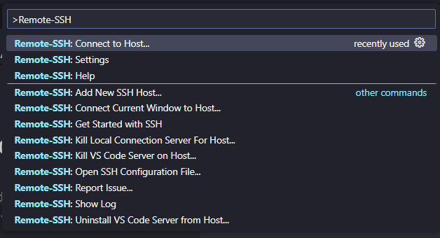

- **3.4** Press `Configure SSH Host…`\
    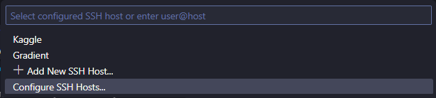

- **3.5** Select `~/.ssh/config`, usually the first file.\
    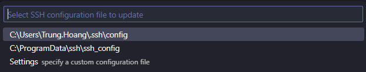

- **3.6** Add the following information to the config file (it never changes between sessions):
    ```
    Host Kaggle
        HostName 127.0.0.1
        Port 2222
        User root
    ```
    - Host: SSH's name, whatever you want (e.g., "Kaggle")
    - HostName: `127.0.0.1` (your laptop-side `zrok2 access private --bind` endpoint)
    - Port: `2222` (must match the `--bind` port)
    - User: root (keep as root)

- **3.7** Press `Ctrl S` and `Ctrl Shift P` -> `Remote-SSH: Connect to Host…`
    

- **3.8** Press `Kaggle` that you named `Host: Kaggle`
    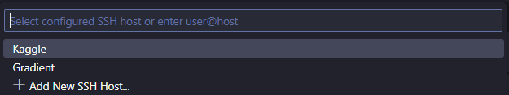

- **3.9** When prompted, enter the password you set in step **2.5** (default is `kaggle`)

- **3.10** Press `continue` (Note: If a list appears to select the operating system, please select `linux`):
    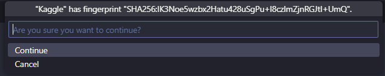

- **3.11** At the bottom left corner shows as shown in the picture that ssh was successful:
    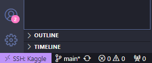

# 4. Using

- **4.1** Press `Ctrl K O` -> Enter the path `/kaggle` -> Press `ok`.
    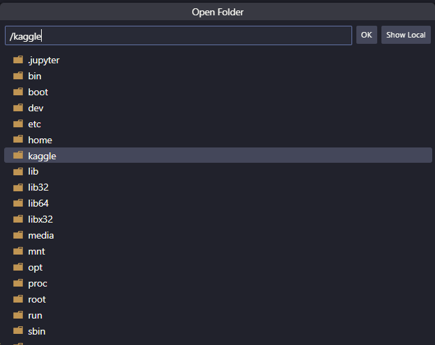

- **4.2** Open terminal press `Ctrl J` -> enter `conda init` -> press kill as shown in the picture.
    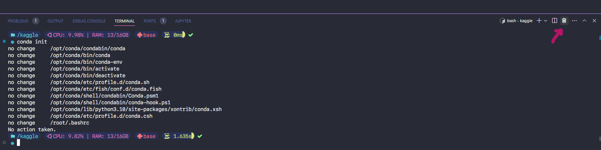


- **4.3** Activate cuda:
    <!-- - Run the following scripts in terminal to install cuda (`Ctrl J` to open terminal):
        ```bash
        cd /kaggle/working/remote-ssh-kaggle-vscode
        bash install_cuda.sh
        ```
    - Select language and press OK as shown in the picture:
    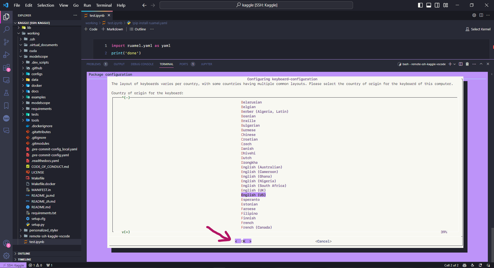 -->

    - Run the following scripts in terminal to activate cuda (`Ctrl J` to open terminal):
        ```bash
        sudo apt install nvidia-utils-515 -y
        ```


- **4.4** Check GPU `nvidia-smi`:
    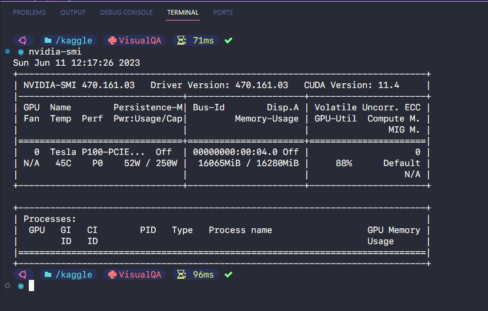


- **4.5** After each time stopping a session and running a new session notebook on Kaggle, you only need to perform the following operations in order to continue using: 
    - Run cell 4 to get a new share token
    - On your laptop, restart `zrok2 access private --bind 127.0.0.1:2222 <new-share-token>` (SSH config stays the same)
    - Connect via VS Code (steps 3.7 -> 3.8 -> 3.9)
    - Continue working (steps 4.1 -> 4.2 -> 4.3 -> 4.4)


# <font color="clay"> <p style="text-align:center"> Tips and Tricks </p> </font>

Here are some tips and tricks to make the most out of your remote-SSH Kaggle setup:
- To maintain a continuous session, remember to close the notebook session and SSH back in before reaching the 30-hour GPU usage limit. By doing so, you can extend your GPU usage to a maximum of 42 hours per week.
- Use the terminal in Visual Studio Code for easier command-line interactions and workflows.
- Take advantage of the debugging capabilities in Visual Studio Code to streamline your Kaggle projects.
- Easily manage and work with .py files by organizing your code in a familiar file-based structure.
- On the right bar of the `Data` section you will see 2 sections `Input` and `Output`:
    - With `Input` as the place to receive data from kaggle and you do not have the right to edit on visual studio code, the corresponding dir is `/kaggle/input/...` The maximum storage memory for your private data is ~107GB, and for public data is unlimited.
    - `Output` is where you will work, corresponding to the dir of `/kaggle/working/...` Maximum storage memory is ~20GB.
    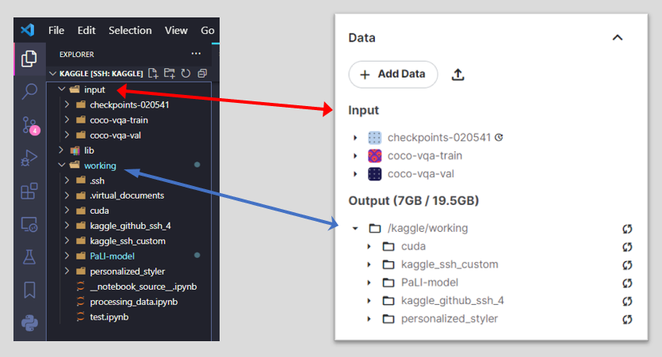


# Conclusion
With remote-SSH Kaggle using Visual Studio Code, you can unlock the full potential of Kaggle and enjoy a seamless development experience. Start leveraging the power of Kaggle's utilities while benefiting.